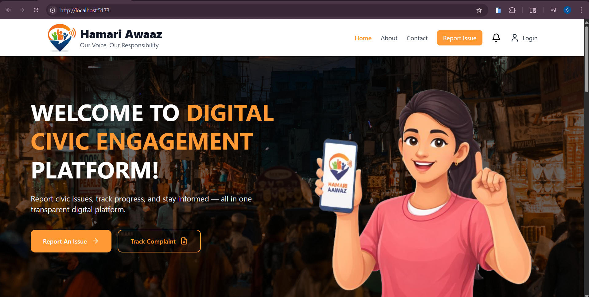
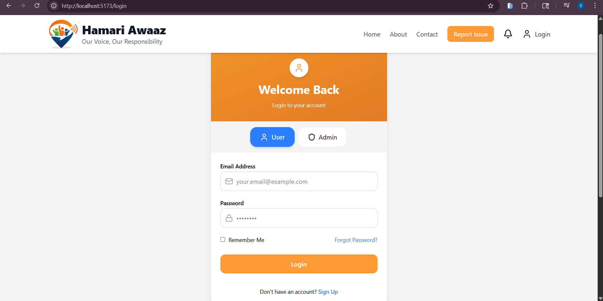
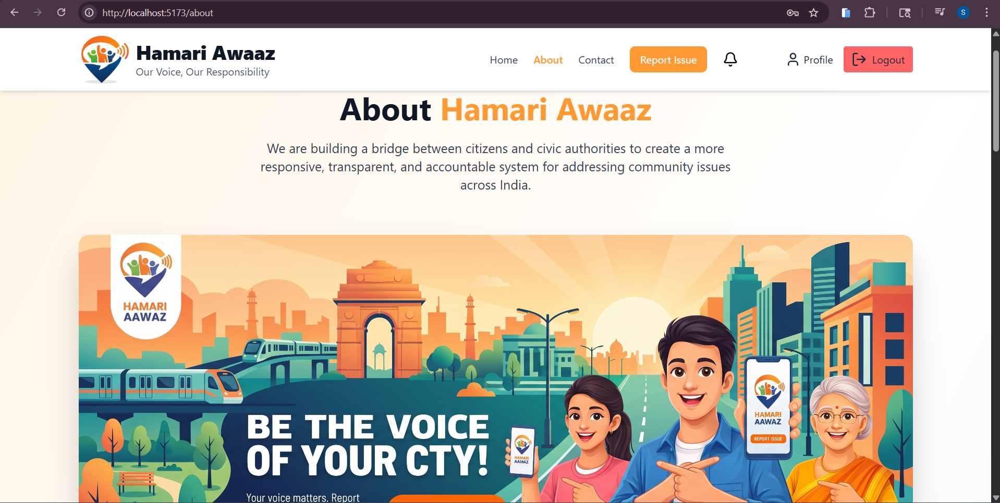
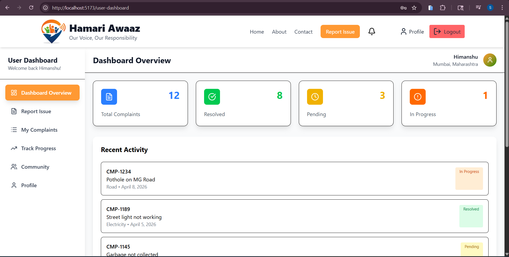
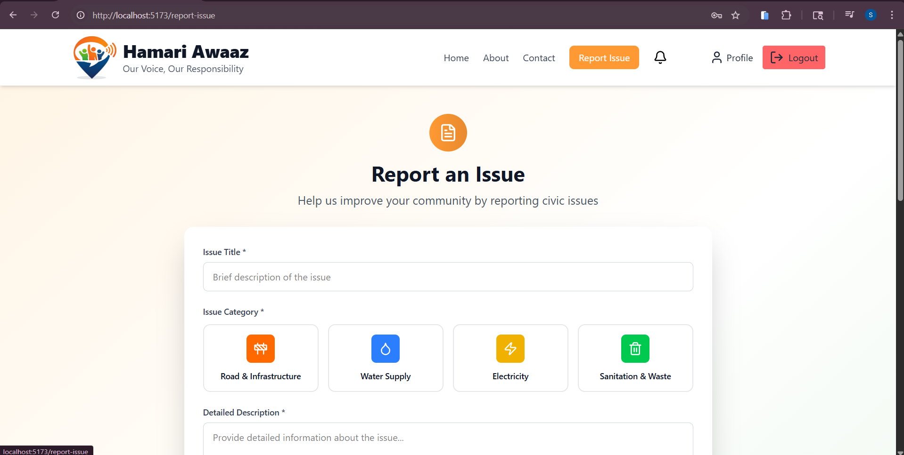

# Hamari Awaaz — Digital Civic Issue Reporting Platform

Hamari Awaaz is a modern web application designed to empower citizens to report, track, and engage with civic issues in their locality.

---

## 🚀 Features

### 🔐 Authentication
- User Signup & Login
- JWT-based authentication
- Protected routes
- Role-based access (User / Admin)

### 📊 Dashboards
- User Dashboard
- Admin Dashboard (UI ready)
- Overview of complaints and activity

### 👤 User Profile
- View user details
- Edit profile 
- Location-based data handling

### 📝 Complaint System (UI Ready)
- Report issues
- Track complaint status
- View recent activity

### 🌐 Community Section
- Engage with other users
- Share concerns and updates

---

## 🛠️ Tech Stack

### Frontend
- React.js
- Tailwind CSS
- Framer Motion
- Axios

### Backend (In Progress)
- Node.js
- Express.js
- MongoDB
- JWT Authentication

---

## 📂 Project Structure
src/
│
├── api/ # Axios configuration
├── components/ # Reusable UI components
├── pages/ # Pages (Login, Signup, Dashboard, etc.)
├── services/ # API service functions
├── utils/ # Constants and helpers

---

## 📸 Screenshots

### 👤 Landing Page

### 🔑 Login Page

### 📝 About Page

### 📊 User Dashboard

### 👤 Report Issue Page

